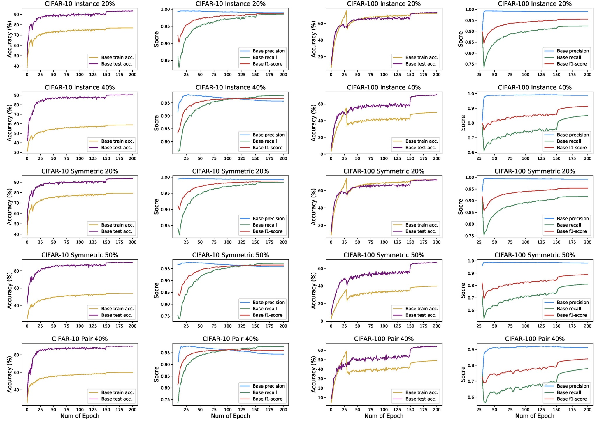

# Entropy-based selection for Learning with Noisy Labels

Official PyTorch Implementation of paper "A Joint Training Framework for Learning with Noisy Labels". 

> Paper "A Joint Training Framework for Learning with Noisy Labels" is accepted to **SCIENTIA SINICA Informationis 2023**.

> 论文 “面向标签噪声的联合训练框架” 被 **中国科学-信息科学 2023** 接收.

# Training

For CIFAR-10, `warm_up = 10`,`model = resnet18`

For CIFAR-100, `warm_up = 30`,`model = resnet34`

Noise Labels Settings : `CIFAR-10 & CIFAR-100 (sym 0.2, sym 0.5, pair 0.4, instance 0.2, instance 0.4)`

### Run

```
python main.py --dataset cifar10 --noise_mode sym --r 0.2 --penal_coeff 0.3 --T 3 --threshold 0.3 --main_type base --gpuid 0
```

> Note that the code refers to [Dividemix](https://github.com/LiJunnan1992/DivideMix) (ICLR 2020) and [Self-Filtering](https://github.com/1998v7/Self-Filtering) (ECCV 2022). 


### More results

Base denotes the Entropy-based selection criterion.


<figure class="half">
    
</figure>


# Cite
Please kindly cite our work if this work is helpful for your research.

```
@article{:/publisher/Science China Press/journal/SCIENTIA SINICA Informationis///10.1360/SSI-2022-0395,
  author = "wei qi,sun haoliang,yin yilong,ma yuling",
  title = "面向标签噪声的联合训练框架",
  journal = "SCIENTIA SINICA Informationis",
  year = "2023",
  pages = "-",
  url = "http://www.sciengine.com/publisher/Science China Press/journal/SCIENTIA SINICA Informationis///10.1360/SSI-2022-0395,
  doi = "https://doi.org/10.1360/SSI-2022-0395"
}
```
